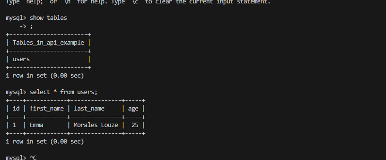
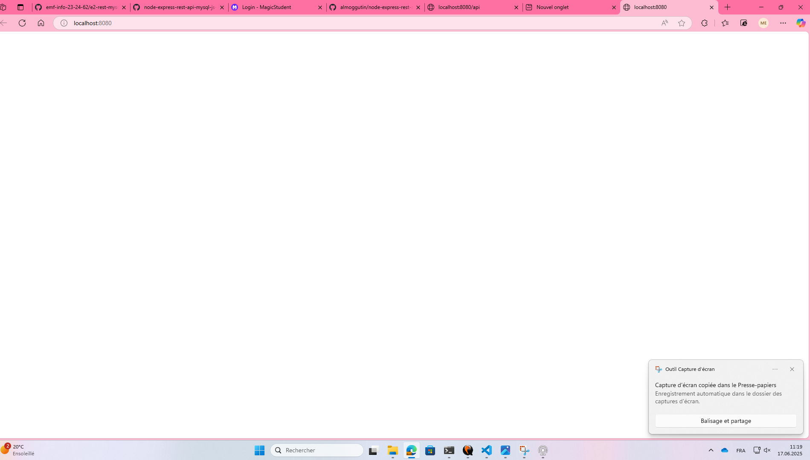
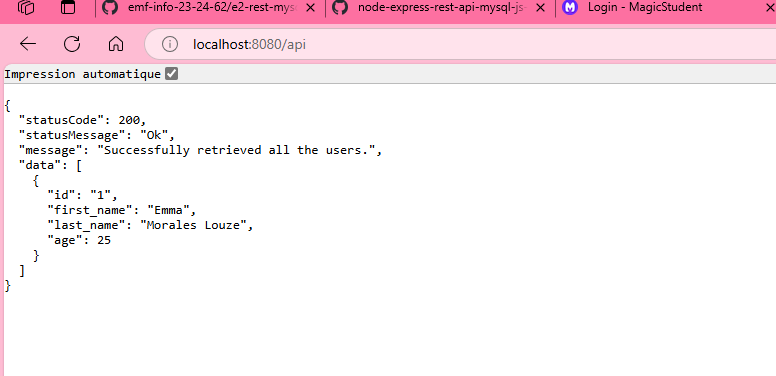

# Documentation technique
Voici mon fichier Dockerfile 
```Dockerfile
# image de base
FROM node:18-alpine

# Définir le répertoire de travail
WORKDIR /app

# Clôner le répertoire 
RUN apk add --no-cache git && \
    git clone https://github.com/almoggutin/node-express-rest-api-mysql-js-example.git api

# Passer dans le dossier de l'app clonée
WORKDIR /app/api

# Installer les dépendances npm
RUN npm install
RUN npm install -g nodemon

# Exposer le port 8080
EXPOSE 8080

# Commande de démarrage de l'application
CMD ["node", "src/index.js"]
```
Ce fichier m'a permis de pouvoir clôner le repos de node-express-api-mysql pour pouvoir preparer la partie backend. J'ai du installer les différentes dépendances npm, exposer le port 8080 comme demandé à la consigne et j'ai fait la commande de démarrage, dans ce cas "index.js" se trouve dans le sous-dossier src.
Ensuite le docker-compose.yml se trouve toute la configuration pour la base de données, et la liaison avec le back-end. On trouve aussi un volume pour que les données soient persistantes. Voici mon docker-compose.yml :
```yml 
services:
  db:
    image: mysql:5.7
    ports:
      - "3306:3306"
    restart: always
    environment:
      MYSQL_ROOT_PASSWORD: rootpass
      MYSQL_DATABASE: api_example
      MYSQL_USER: user347
      MYSQL_PASSWORD: pass347
    volumes:
      - mysql-data:/var/lib/mysql
      - ./db/init.sql:/docker-entrypoint-initdb.d/init.sql:ro
    healthcheck:
      test: ["CMD", "mysqladmin", "ping", "-h", "localhost"]
      interval: 10s
      timeout: 5s
      retries: 5

  backend:
    build: ./backend
    ports:
      - "8080:8080"
    environment:
      NODE_ENV: development
      PORT: 8080
      DB_HOST: db
      DB_PORT: 3306
      DB_USERNAME: user347
      DB_USERNAME_PASSWORD: pass347
      DB_NAME: api_example
    depends_on:
      db:
        condition: service_healthy
    restart: always

volumes:
  mysql-data: 
```
Le healthcheck m'a permis de voir si mon conteneur était en bonne santé car j'ai eu des problèmes pour la connexion à la base de données.
La connexion à la base de données a été mon plus grand problème durant cette évaluation j'ai pu vérifier si les données étaient vraiment là grâce à ces deux commandes :
```
docker exec -it restapi-db-1 mysql -u user347 -ppass347 api_example
```
pour se connecter à la base de données, et pour contrôler que mes données soient là :

Voici ce qui apparait quand je vais sur localhost:8080 :

Rien apparait c'est normal car il n'y a pas de front-end \
Et voici ce qui apparaît quand je fais un localhost:8080/api :

On peut apercevoir que mon utilisateur que j'ai inséré auparavant est là.